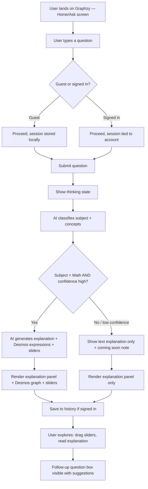
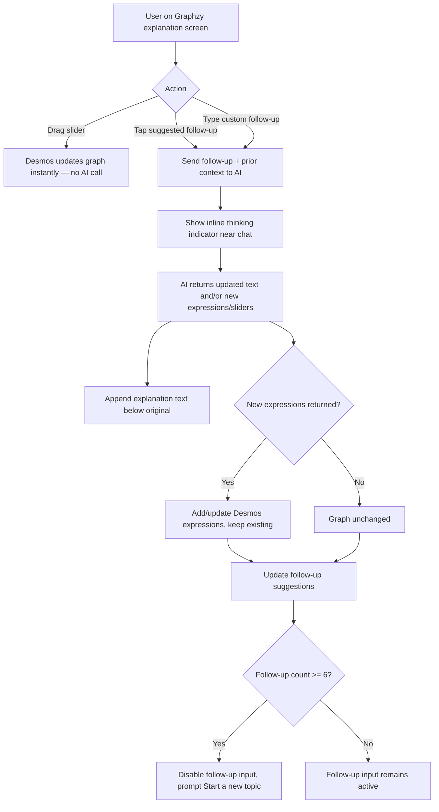
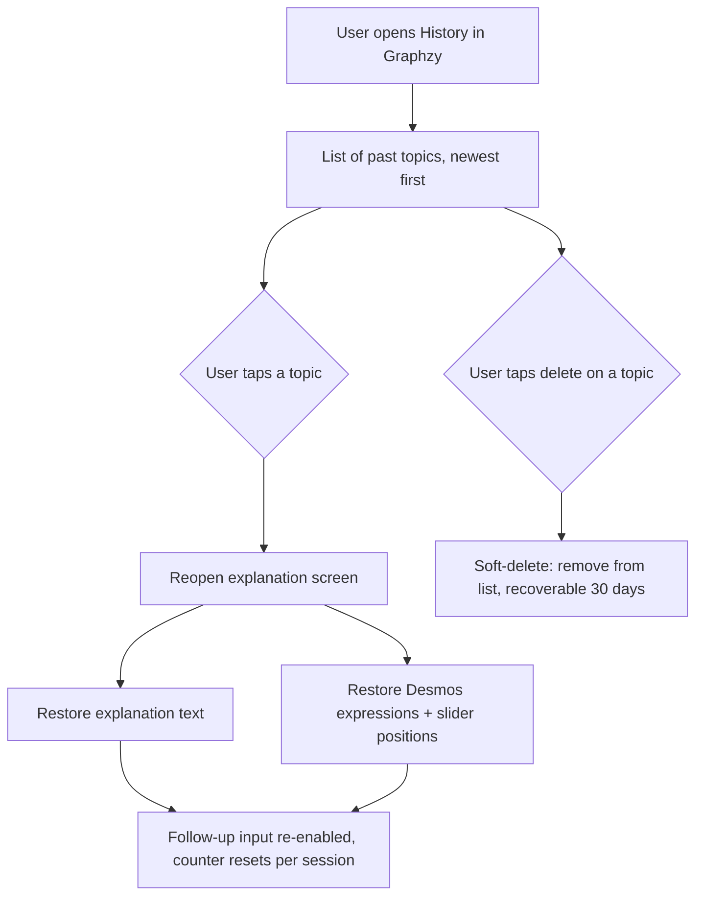
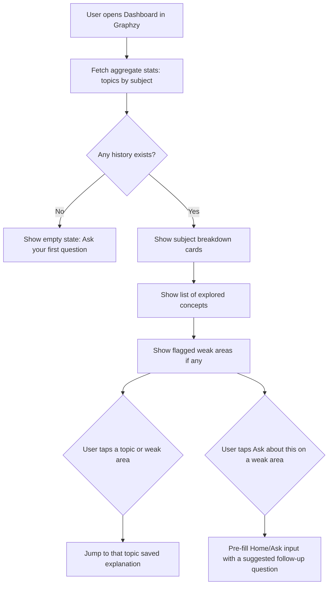
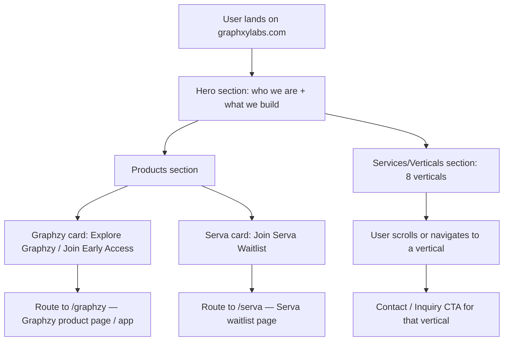
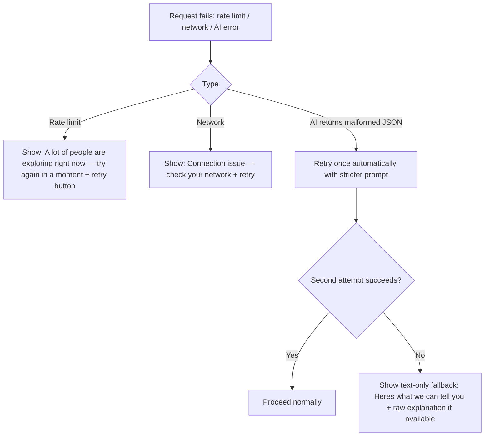

# User Flow Document
## Graphzy — Visualization Platform by Graphxy Labs

This document covers the primary flows for the MVP pilot: asking a question, viewing the interactive explanation, follow-up interaction, history, and dashboard. Diagrams are written in Mermaid syntax.

---

## 1. Primary Flow — Ask → Explanation → Visual

---

## 2. Follow-up Interaction Flow

---

## 3. History Flow

---

## 4. Dashboard Flow

---

## 5. Graphxy Labs Landing Page Flow

---

## 6. Error & Edge Case Flows

---

## 7. End-to-End Session Example (Narrative)

1. A guest user lands on Graphzy (via graphxylabs.com/graphzy or graphzy.io) and types: *"Why does increasing 'a' in y = ax² make the parabola narrower?"*
2. The app shows a brief thinking animation (1–3 seconds).
3. Classification returns `subject: math, confidence: 0.95, concepts: ["quadratic functions", "vertical stretch"]`.
4. The explanation panel renders a 2–3 sentence summary and the key idea.
5. A Desmos graph appears showing `y = a*x^2` with a slider for `a` from -5 to 5.
6. The user drags the slider — the graph updates instantly.
7. The user taps a suggested follow-up: *"What happens if a is negative?"*
8. The AI responds and the canvas highlights to signal the visual responded.
9. The session is saved; user is prompted to sign up to keep it.
10. Later, the user opens the Dashboard and sees "Quadratic functions" listed under Math.
