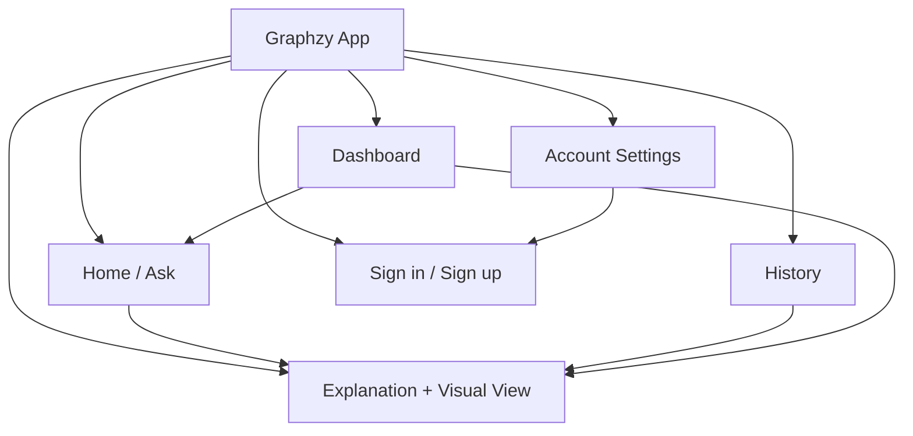
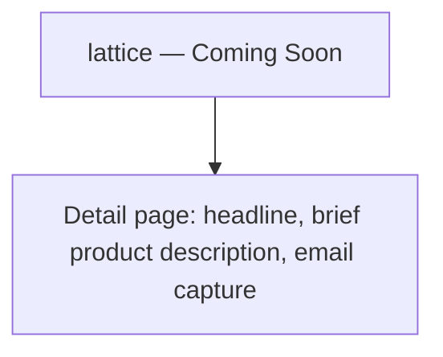
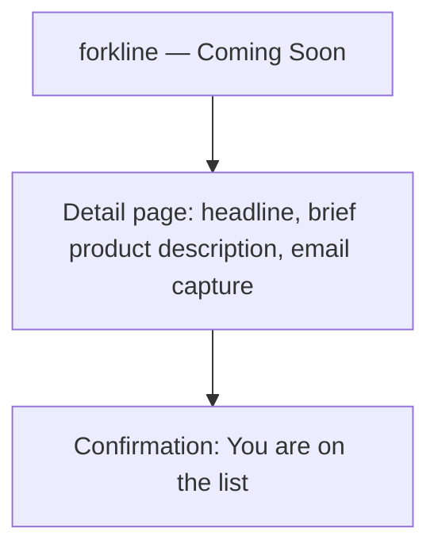

# Information Architecture
## Graphxy Labs — Company + Product Ecosystem

This document covers two levels of IA:
1. **Graphxy Labs** — the company website and product ecosystem (graphxylabs.com)
2. **Graphzy** — the visualization platform product (/graphzy or graphzy.io)

---

## 1. Company-Level Site Map (graphxylabs.com)

```mermaid
flowchart TD
    Root[graphxylabs.com] --> Home[Home / Landing Page]
    Root --> Products[Products]
    Root --> Services[Services]
    Root --> Company[Company]
    Root --> Contact[Contact]

    Products --> Graphzy[/graphzy — AI-Powered STEM Visualizer]
    Products --> Clampbox[/clampbox — Confidential Execution Infrastructure — COMING SOON]
    Products --> Forkline[/forkline — Restaurant Ops Platform — COMING SOON]
    Products --> Lattice[/lattice — Startup Ops Platform — COMING SOON]

    Services --> S1[Management Systems]
    Services --> S2[Web Development]
    Services --> S3[Mobile App Development]
    Services --> S4[AI and Machine Learning]
    Services --> S5[Data Science and Analytics]
    Services --> S6[Custom Software Development]
    Services --> S7[Automation and Workflow Solutions]
    Services --> S8[Scalable Tech Products for Businesses]

    Company --> About[About Graphxy Labs]
    Company --> Blog[Blog / Insights — future]
    Company --> Careers[Careers — future]
```

---

## 2. Landing Page Structure (graphxylabs.com)

Section order on the Graphxy Labs homepage:

| # | Section | Purpose |
|---|---|---|
| 1 | **Hero** | Who Graphxy Labs is and what the company builds — one strong headline, brief descriptor, two primary CTAs (Explore Graphzy, Explore Forkline) |
| 2 | **Products** | Graphzy card (active, Explore Graphzy CTA, route /graphzy) + Clampbox card (COMING SOON, Join Waitlist CTA, route /clampbox) + Forkline card (COMING SOON, Join Waitlist CTA, route /forkline) + Lattice card (COMING SOON, Join Waitlist CTA, route /lattice) |
| 3 | **What We Build** | Eight verticals, each with a concise description and example offerings |
| 4 | **Company Positioning** | Short prose block: engineering-driven, product-first, premium, trustworthy |
| 5 | **Footer** | Home, Services, Products, Contact, Privacy, Terms |

### Eight Service Verticals

**Management Systems** — ERP systems, CRM systems, admin dashboards, internal workflow tools, business operations platforms.

**Web Development** — Marketing websites, SaaS platforms, web applications, landing pages, portals and dashboards.

**Mobile App Development** — iOS apps, Android apps, cross-platform apps, consumer apps, business-facing mobile applications.

**AI and Machine Learning** — AI assistants, predictive systems, NLP features, recommendation engines, automation using AI.

**Data Science and Analytics** — Dashboards, data pipelines, reporting systems, KPI tracking, business intelligence.

**Custom Software Development** — Bespoke business applications, internal tools, client portals, industry-specific solutions.

**Automation and Workflow Solutions** — Approval flows, notifications, task automation, process optimization, integration workflows.

**Scalable Tech Products for Businesses** — SaaS products, MVP development, product engineering, scalable architecture, growth-ready platforms.

---

## 3. Graphzy Product Site Map (/graphzy)



---

## 4. Graphzy Navigation Model

Persistent left rail on desktop / bottom tab bar on mobile:

| Destination | Icon (lucide) | Purpose |
|---|---|---|
| Ask (Home) | `sparkles` | Default landing screen; new question input |
| History | `clock` | Past topics, reopen explanations |
| Dashboard | `layout-grid` | Topic-wise summary, weak areas |
| Account | `user` | Sign in/out, profile, preferences |

The **Explanation + Visual view** is not a standalone nav destination — it is the result state reached from Ask, History, or Dashboard, and always includes a "← New question" affordance back to Home.

---

## 5. Forkline Product Site Map (/forkline)
Status: COMING SOON. The /forkline route is the Forkline detail page.

## 6. Lattice Product Site Map (/lattice)
Status: COMING SOON. The /lattice route is the Lattice detail page.

Status: COMING SOON. The /forkline route is the Forkline detail page.

## 6. Lattice Product Site Map (/lattice)
Status: COMING SOON. The /lattice route is the Lattice detail page.


Status: Coming Soon. The /forkline route is the Forkline detail page only.



Full Forkline IA will be documented separately during Forkline's pre-development phase.

---

## 6. Graphzy Content Hierarchy

### Home / Ask
1. Graphxy Labs wordmark + Graphzy product identity — minimal, top-left
2. Primary input (question box) — visually dominant, centered
3. Subject hint chips — secondary
4. Recent topics (last 3) — tertiary, below fold or side panel on desktop

### Explanation + Visual View
1. Question asked (small, as breadcrumb/header)
2. Subject tag (color-coded per design system)
3. Visual canvas (Desmos graph + sliders) — primary focus, largest element
4. Explanation text (summary + key idea) — adjacent to canvas
5. Follow-up suggestions (chips) + follow-up input — below explanation
6. Conversation thread — appended below

### History
1. Filter/sort controls (subject, date) — top
2. List of topic cards: title, subject tag, date, preview snippet
3. Empty state if no history

### Dashboard
1. Subject breakdown cards (Math populated; others greyed "coming soon" in MVP)
2. Concepts explored (grouped list)
3. Weak areas (highlighted with "Ask about this" action)
4. (V2) Quiz performance summary

---

## 7. URL / Route Structure

### graphxylabs.com
| Route | Screen |
|---|---|
| `/` | Home / Landing Page |
| `/graphzy` | Graphzy product page / app entry |
| `/clampbox` | Clampbox detail page |
| `/forkline` | Forkline detail page |
| `/lattice` | Lattice detail page |
| `/services` | Services / verticals overview |
| `/contact` | Contact |

### graphzy app (within /graphzy or standalone domain)
| Route | Screen |
|---|---|
| `/` or `/ask` | Home / Ask |
| `/explain/:sessionId` | Explanation + Visual view |
| `/history` | History list |
| `/dashboard` | Dashboard |
| `/auth/sign-in`, `/auth/sign-up` | Auth screens |
| `/account` | Account settings |

---

## 8. Cross-Cutting States

Every screen accounts for:
- **Guest vs signed-in** — History/Dashboard show "Sign up to save your progress" for guests
- **Empty state** — no history, no dashboard data yet
- **Loading state** — AI thinking, graph initializing
- **Error state** — rate limit, network, malformed AI response
