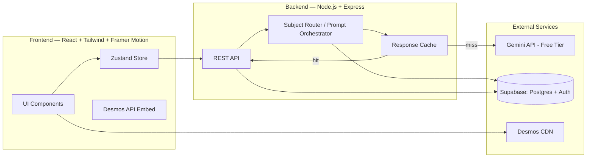

# Technical Design Document
## Graphxy Labs — Graphzy Visualization Platform

---

## 1. Architecture Overview



---

## 2. Repository Structure

```
graphxy-labs/
├── apps/
│   ├── graphzy-web/          # Graphzy React frontend
│   └── graphxy-site/         # graphxylabs.com marketing site (Next.js)
├── packages/
│   ├── ui/                   # Shared design system components
│   └── types/                # Shared TypeScript types
├── services/
│   └── graphzy-api/          # Node.js + Express backend for Graphzy
└── README.md
```

A monorepo structure (Turborepo recommended) allows Graphzy and the Graphxy Labs marketing site to share design tokens and types, and prepares the codebase to onboard Forkline later without architecture debt.

---

## 3. Frontend (Graphzy Web App)

- **Framework:** React (Vite), Tailwind CSS, Framer Motion.
- **State:** Zustand — `sessionStore` (current question, explanation, expressions, sliders, follow-up thread) and `userStore` (auth state, history cache, dashboard aggregates).
- **Visualization:** Desmos Calculator API loaded via script tag, instantiated once, controlled imperatively via a thin `<DesmosCanvas expressions sliders onSliderChange />` wrapper component.
- **Routing:** React Router.
- **Hosting:** Vercel (free tier).

---

## 4. Frontend (graphxylabs.com Marketing Site)

- **Framework:** Next.js (App Router) for SEO, fast static generation, and easy addition of product/landing pages.
- **Styling:** Tailwind CSS with shared design tokens from `packages/ui`.
- **Key pages:** `/` (landing page with hero, products, verticals), `/graphzy` (product page / app redirect), `/forkline` (waitlist page), `/lattice` (waitlist page), `/services` (verticals detail).
- **Hosting:** Vercel.

---

## 5. Backend (Graphzy API)

- **Framework:** Node.js + Express, deployed on Render or Fly.io (free tier).
- **Responsibilities:**
  1. Receive question + optional prior session context.
  2. Run classification + explanation generation against Gemini.
  3. Validate/repair AI JSON output (schema check, one retry with stricter prompt if invalid).
  4. Cache responses (see §7).
  5. Persist sessions/history to Supabase.
  6. Serve history/dashboard aggregate queries.

- **Why a backend (vs direct client → Gemini):** keeps API key server-side, enables shared caching across users, and allows response post-processing before the client sees it.

---

## 6. AI Integration (Gemini)

- **Model:** Gemini 2.0/2.5 Flash (free tier) — fast and cheap enough for classification + explanation in one or two calls.
- **Call structure:**
  - **Call 1 — Classify + Explain (combined):** single prompt returns the full JSON schema (`subject`, `confidence`, `concepts`, `summary`, `key_idea`, `expressions`, `sliders`, `follow_up_suggestions`) in one round trip.
  - **Call 2+ — Follow-up:** compact context block (subject, concepts, current expressions, prior summary — not full conversation history) plus the new question.
- **Prompting:** system prompt enforces "respond with JSON only, matching this schema exactly." Subject-specific: if subject isn't math, omit `expressions`/`sliders` entirely rather than guessing.
- **JSON validation:** Zod schema validation on backend; on failure, one retry with schema clarification appended.

---

## 7. Caching & Rate-Limit Strategy

Critical for staying within Gemini free-tier limits during a pilot of hundreds–thousands of users.

- **Cache key:** hash of normalized (lowercase, stripped) question text. Identical/near-identical questions across users return cached results.
- **Cache store:** Supabase table (`ai_response_cache`) keyed by hash; TTL 30 days (math explanations don't go stale).
- **Rate-limit handling:** 429 from Gemini → backend queues the request (short in-memory delay/backoff) rather than failing immediately. Queue exceeds threshold → return the "lots of people exploring right now" user-facing state.
- **Cost control on follow-ups:** cap at 6 per session; keep follow-up context minimal (summary + expressions, not full chat history).

---

## 8. Subject Routing Logic

For MVP, only `math` produces a visual. Router is simple and intentionally extensible:

```
if (confidence < 0.6)     → ask user to confirm subject (default: text-only)
else if (subject == "math")    → render DesmosCanvas with expressions/sliders
else                           → render text-only + "visual support coming soon for {subject}"
```

V2: router gains `chemistry` → 3Dmol.js branch, `biology` → Cytoscape.js branch, `physics` → Canvas/Three.js branch. Architecture does not need to change — new branches added, existing ones untouched.

---

## 9. Database

Supabase (managed Postgres + Auth). See **Database Schema Document** for full table definitions. Core tables: `sessions`, `visual_states`, `follow_ups`, `concepts`, `session_concepts`, `ai_response_cache`.

---

## 10. Forkline Backend (Future — Reference)

Forkline will be a separate backend service (Node.js + Express or NestJS) with its own Supabase project or schema namespace. It will not share database tables with Graphzy but may share infrastructure patterns, CI/CD pipelines, and the monorepo `packages/ui` design system. Forkline backend spec is produced during Forkline pre-development.

---

## 11. Environments & Deployment

| Environment | Graphzy Frontend | Graphxy Labs Site | Backend | DB |
|---|---|---|---|---|
| Local dev | Vite dev server | Next.js dev | `node` with `.env` | Supabase dev project |
| Pilot/Production | Vercel | Vercel | Render/Fly.io | Supabase production |

- Secrets (Gemini API key, Supabase service role key) stored as environment variables on the host — never exposed to the client.
- CORS restricted to deployed frontend origins (both graphxylabs.com and graphzy app domain).

---

## 12. Monitoring (Lightweight, Pilot)

- Log every AI call's latency, success/failure, cache hit/miss.
- `/health` endpoint for uptime checks.
- Daily Gemini call count vs. free-tier daily limit logged for easy founder visibility.

---

## 13. Open Technical Risks

- **Desmos licensing for commercial use** — confirm terms before monetization; `DesmosCanvas` is a swappable component.
- **Gemini free-tier daily cap** — if pilot exceeds it, caching + queueing are the only short-term levers before a paid tier is needed.
- **JSON reliability from LLM** — Zod validation + one retry is the MVP mitigation; consider Gemini structured output mode if failure rates are high in practice.
