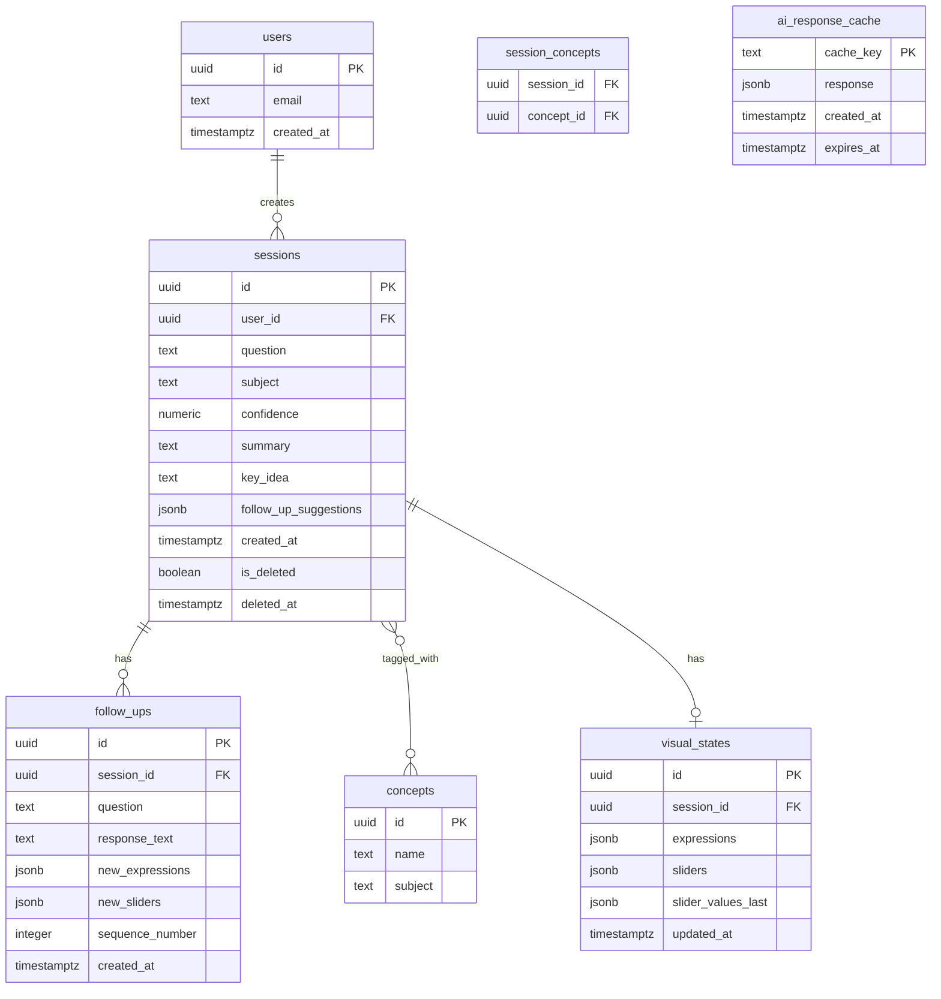

# Database Schema Document
## Graphzy — Visualization Platform by Graphxy Labs

Target: Supabase (managed Postgres + Auth). This schema covers **Graphzy only**. Serva will use a separate Supabase project (or separate schema namespace with strict RLS separation) to maintain clean product-level isolation.

---

## 1. Entity-Relationship Diagram

---

## 2. Table Definitions

### `users` (managed by Supabase Auth)
Standard Supabase Auth table. Referenced via `user_id` foreign keys. No custom columns needed for the Graphzy MVP.

### `sessions`
One row per topic thread — the initial question plus everything generated from it.

| Column | Type | Notes |
|---|---|---|
| `id` | uuid, PK | |
| `user_id` | uuid, FK → users.id, nullable | Nullable supports guest sessions (merged on sign-up) |
| `question` | text | Original user question |
| `subject` | text | `math`, `chemistry`, `biology`, `physics`, or `unclassified` |
| `confidence` | numeric | Classification confidence score |
| `summary` | text | AI-generated explanation summary |
| `key_idea` | text | One-sentence "aha" |
| `follow_up_suggestions` | jsonb | Array of suggested follow-up strings |
| `created_at` | timestamptz | Default `now()` |
| `is_deleted` | boolean | Default `false` — soft delete |
| `deleted_at` | timestamptz | Nullable |
| `product` | text | Default `graphzy` — allows schema to support multiple Graphxy Labs products in future without migration |

**Indexes:** `(user_id, created_at desc)` for history listing; `(subject)` for dashboard aggregation; `(product, user_id)` for cross-product queries if future products share auth.

### `visual_states`
1:1 with `sessions`, for math in MVP. Stores Desmos configuration so a session can be reopened in its last state.

| Column | Type | Notes |
|---|---|---|
| `id` | uuid, PK | |
| `session_id` | uuid, FK → sessions.id, unique | |
| `expressions` | jsonb | Array of Desmos expression strings/objects |
| `sliders` | jsonb | Array of `{variable, min, max, default, step, label}` |
| `slider_values_last` | jsonb | Last known slider values for restoring state |
| `updated_at` | timestamptz | |

### `follow_ups`
One row per follow-up question within a session.

| Column | Type | Notes |
|---|---|---|
| `id` | uuid, PK | |
| `session_id` | uuid, FK → sessions.id | |
| `question` | text | |
| `response_text` | text | |
| `new_expressions` | jsonb | Nullable — added/updated Desmos expressions, if any |
| `new_sliders` | jsonb | Nullable |
| `sequence_number` | integer | 1–6; enforces follow-up cap at application layer |
| `created_at` | timestamptz | |

### `concepts` / `session_concepts`
Normalized tags for dashboard aggregation. Many-to-many via `session_concepts`.

| `concepts` column | Type |
|---|---|
| `id` | uuid, PK |
| `name` | text, unique per subject |
| `subject` | text |

| `session_concepts` column | Type |
|---|---|
| `session_id` | uuid, FK |
| `concept_id` | uuid, FK |

### `ai_response_cache`
Caches full AI JSON responses keyed by normalized-question hash, to reduce Gemini calls.

| Column | Type | Notes |
|---|---|---|
| `cache_key` | text, PK | Hash of normalized question |
| `response` | jsonb | Full AI response payload |
| `created_at` | timestamptz | |
| `expires_at` | timestamptz | `created_at + 30 days` |

---

## 3. Dashboard Aggregation (computed, no dedicated table)

- **Topics by subject:** `SELECT subject, count(*) FROM sessions WHERE user_id = :id AND is_deleted = false AND product = 'graphzy' GROUP BY subject`
- **Concepts explored:** join `sessions` → `session_concepts` → `concepts` for the user
- **Weak areas:** sessions where follow-up count ≥ 2 AND follow-up text matches confusion-keyword heuristic — computed at query time or cached as a boolean flag per session.

---

## 4. Row-Level Security (Supabase)

- `sessions`, `visual_states`, `follow_ups`: RLS policy restricting `select/insert/update` to rows where `user_id = auth.uid()`, with an exception allowing `user_id IS NULL` writes from the backend service role only (guest sessions).
- `ai_response_cache`: no user-level RLS — shared across all users, read only via backend service role.
- `concepts` / `session_concepts`: `concepts` globally readable; `session_concepts` follows `user_id` ownership via its parent `session`.

---

## 5. Migration Notes for V2 (Graphzy)

- Add `quizzes` and `quiz_attempts` tables for auto-generated quizzes.
- Add `practice_plans` table for the daily-practice-plan feature.
- `visual_states.expressions`/`sliders` are intentionally generic (jsonb) so chemistry (`smiles`, `pdb`), biology (graph nodes/edges), and physics (simulation initial conditions) can reuse the same table with subject-specific keys.

---

## 6. Serva Database (Future — Reference)

Serva will require its own tables covering orders, tables, inventory, staff, loyalty programs, locations, and POS integrations. These will either live in a separate Supabase project or a fully isolated `serva_` schema namespace with no foreign key relationships to the `graphzy_` tables. Schema design for Serva is part of the Serva pre-development documentation.
