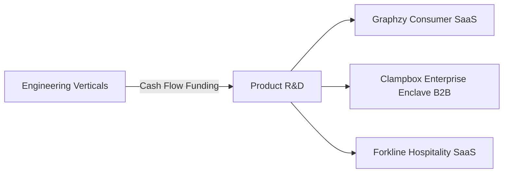

# Business Vision & Market Strategy

Graphxy Labs operates on a dual-engine business model: building premium, scalable proprietary SaaS platforms while funding product research through high-end engineering services.

## Monetization Model

### 1. Consumer Freemium (Graphzy)
- **Free Tier:** Basic math-visual explanations, capped at 5 requests per day.
- **Premium Tier ($8/month):** Unlimited access, complex chemistry, biology, and physics visual canvases, and custom follow-up threads.

### 2. B2B Enterprise Compute (Clampbox)
- **Usage-Based Pricing:** Billed per virtual CPU-hour of attested enclave execution.
- **SDK Licensing:** Corporate agreements for custom deployment templates on AWS/Azure.
