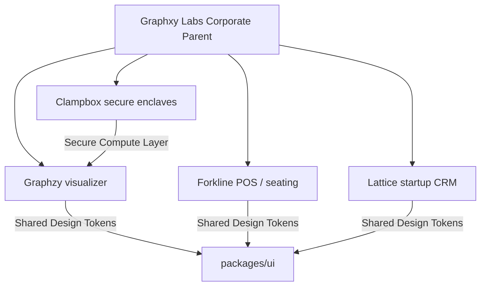

# Ecosystem Integration Overview

All Graphxy Labs products are built as nodes belonging to a single, unified corporate ecosystem. While addressing different industries, they are bound by shared technical systems, visual paradigms, and operational dependencies.

## Shared Architectural Foundations
- **Design Tokens (`packages/ui`):** A shared repository of color definitions, font files, and typography rules.
- **Attestation Infrastructure:** Future backend layers utilize Clampbox enclaves to process sensitive student questions in Graphzy and transaction records in Forkline.
- **Data Feedback Loop:** Aggregate metrics from Graphzy feed into Lattice CRM modules for dashboard visualizations, standardizing our reporting models.
