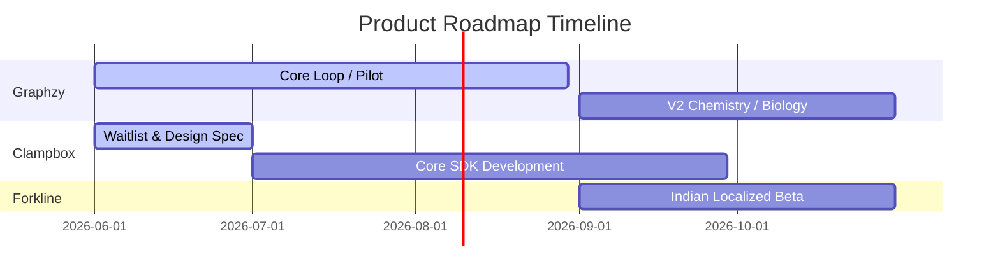

# Product Portfolio Roadmap

This document outlines the development phases, milestones, and cross-project dependencies across our product portfolio.

## Development Schedule

### Phase 1 — Graphzy Pilot & Validation (Current)
- Launch the Math-first Graphzy pilot with 200–1,500 active users.
- Track interactive engagements per session and guest-to-signup conversion rates.
- Establish the visual motion system as the design standard for the website.

### Phase 2 — Clampbox Enclave SDK & Beta
- Begin active development of aws-nitro and intel-sgx container frameworks.
- Wire Clampbox as the secure query orchestrator for pilot users.

### Phase 3 — Forkline Partners & Closed Beta
- Deploy localized restaurant POS and KOT displays with 2–5 partner outlets in Pune/Mumbai.
