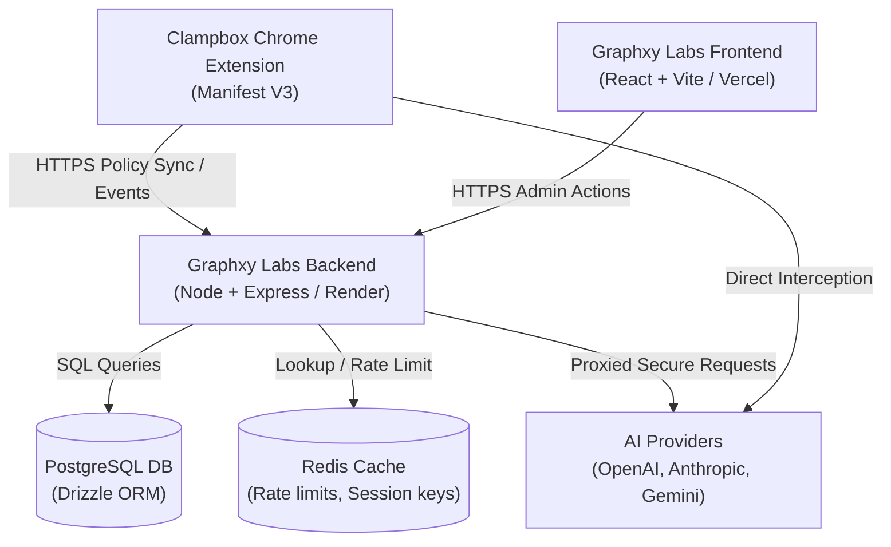
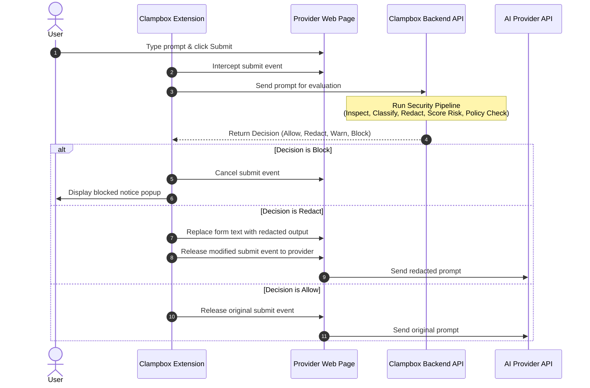
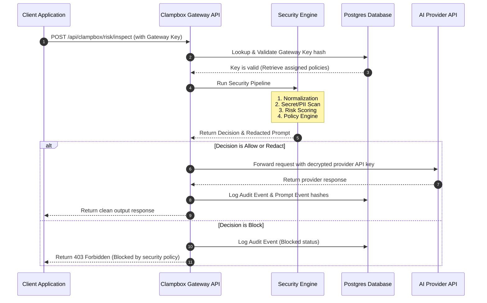
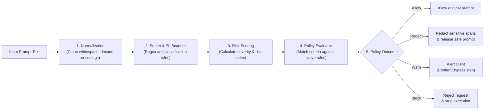

# System Architecture & Data Flow

> **Purpose:** This document details the software architecture, system boundaries, component relationships, and execution pipelines of the Clampbox AI Security Gateway.

## Table of Contents

1. [High-Level System Architecture](#1-high-level-system-architecture)
2. [Repository Structure](#2-repository-structure)
3. [Interaction Flows](#3-interaction-flows)
4. [The Backend Security Pipeline](#4-the-backend-security-pipeline)
5. [Technology Stack](#5-technology-stack)

---

## 1. High-Level System Architecture

Clampbox resides within the Graphxy Labs monorepo. It interfaces with client web browsers, backend engines, databases, and third-party AI model providers.



---

## 2. Repository Structure

```
D:\Graphxy
├── backend/                  # Express.js REST API server
│   ├── clampbox/             # Clampbox product logic
│   │   ├── controllers/      # Route handler controllers
│   │   ├── middleware/       # Request middleware
│   │   ├── routes/           # Endpoint path mappings
│   │   ├── services/         # Core logic (inspection, policy, redaction, audit)
│   │   └── utils/            # Utilities (logger, org resolver)
│   ├── src/                  # Global backend server entrypoint (server.js)
│   └── package.json
├── db/                       # Drizzle ORM database scaffolding
│   └── clampbox/
│       ├── schema/           # Table schema definitions
│       ├── migrations/       # Generated SQL migration files
│       └── db.js             # pg Pool initialization
├── frontend/                 # Vite + React SPA
│   ├── clampbox/             # Clampbox console source
│   │   ├── components/       # Layout shells (CbLayout.jsx, Modal.jsx)
│   │   ├── extension/        # Manifest V3 Chrome Extension source
│   │   ├── services/         # Fetch client wrapper (api.js)
│   │   └── web/              # Console page views (Dashboard, Policies, Keys, etc.)
│   └── src/                  # Graphxy Labs website pages
├── Docs/                     # Product specs, design docs, wireframes, roadmaps
├── docs/                     # Technical developer documentation (this directory)
├── scripts/                  # Utility scripts (populate-docker-cache.ps1)
├── docker-compose.yml
├── docker-compose.dev.yml
├── docker-compose.prod.yml
└── .env.example
```

---

## 3. Interaction Flows

Clampbox processes traffic via two execution loops:

### 3.1 Browser-Based Prompt Interception

Protects end-user interactions on standard chatbot interfaces (ChatGPT, Claude, Gemini, Grok):



### 3.2 API Gateway Routing

Protects developer application requests routing through Clampbox gateway keys:



---

## 4. The Backend Security Pipeline

Every prompt evaluated by the backend passes through a modular, sequential security pipeline:



### Engine Components

| File | Responsibility |
|---|---|
| `inspection.service.js` | Orchestrates the overall sequence and aggregates findings |
| `secretDetection.service.js` | Runs regex checks for passwords, API keys, SSH keys, private keys, database URLs, credentials |
| `classification.service.js` | Maps raw detections to semantic taxonomy classes (PII, Infrastructure, Business Confidential) |
| `riskScoring.service.js` | Evaluates overall prompt threat severity, outputting scores from `0` (no risk) to `100` (critical) |
| `redaction.service.js` | Replaces targeted sensitive substring offsets with structured placeholders (e.g., `[REDACTED_EMAIL]`) |
| `policyEngine.service.js` | Resolves which policies apply and produces the final enforcement action |

### Secure Vault Encryption

Provider API keys stored inside the Vault (`api_keys` table) are symmetrically encrypted using **AES-256-CBC** via `vault.controller.js`. The master encryption key is read from the `CLAMPBOX_ENCRYPTION_KEY` environment variable. Raw encrypted key payloads are **never** returned via the REST API — only metadata fingerprints are exposed.

---

## 5. Technology Stack

| Layer | Technology |
|---|---|
| **Frontend** | Vite, React 18, Tailwind CSS, Framer Motion, Lucide Icons |
| **Backend** | Node.js, Express.js, CORS, Morgan |
| **Database** | PostgreSQL (via Drizzle ORM) |
| **Cache** | Redis (rate limits, policy caching) |
| **Browser Extension** | Chrome Manifest V3 |
| **Containerization** | Docker, Docker Compose |
| **Frontend Hosting** | Vercel |
| **Backend Hosting** | Render |
