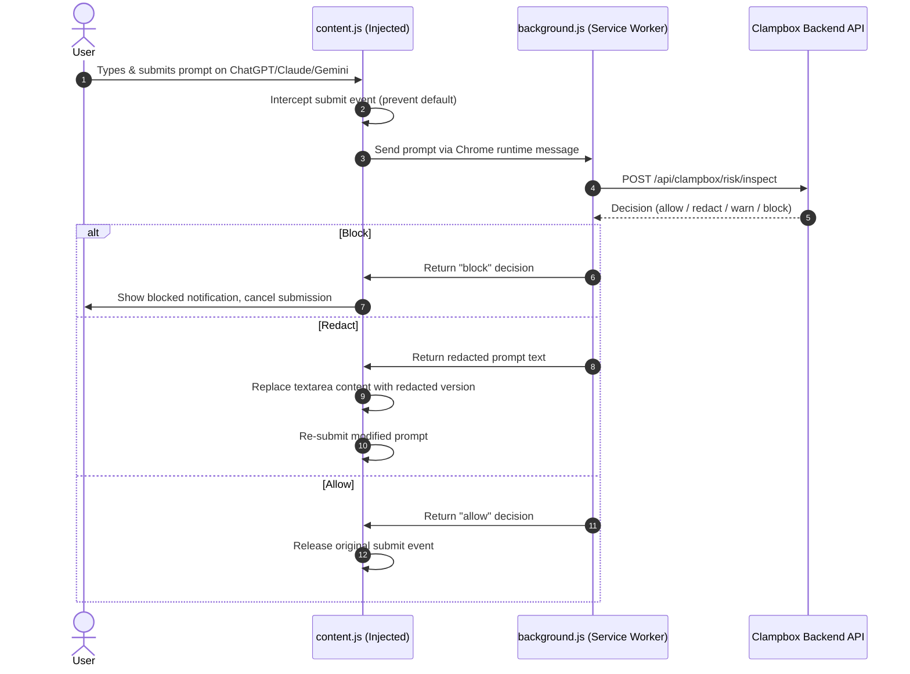

# Clampbox Chrome Extension

> **Purpose:** Complete reference for building, loading, configuring, and publishing the Clampbox Chrome Extension (Manifest V3 companion app).

## Table of Contents

1. [Overview](#1-overview)
2. [Extension Directory Structure](#2-extension-directory-structure)
3. [Manifest V3 Configuration](#3-manifest-v3-configuration)
4. [Building the Extension](#4-building-the-extension)
5. [Loading into Chrome (Development)](#5-loading-into-chrome-development)
6. [Configuring Host Permissions](#6-configuring-host-permissions)
7. [Connecting to the Backend](#7-connecting-to-the-backend)
8. [Architectural Flow](#8-architectural-flow)
9. [Publishing to Chrome Web Store](#9-publishing-to-chrome-web-store)

---

## 1. Overview

The Clampbox Chrome Extension is a **Manifest V3** browser companion that intercepts prompt submissions on AI provider websites before they are sent to external models.

**Supported Platforms:**
- ChatGPT (`https://chatgpt.com`)
- Claude (`https://claude.ai`)
- Google Gemini (`https://gemini.google.com`)

**What the Extension Does:**
1. Intercepts the user's prompt at the point of submission
2. Sends the prompt to the Clampbox Backend API for evaluation
3. Receives a policy enforcement decision (`allow`, `redact`, `warn`, `block`)
4. Either permits the prompt, injects a redacted version, or blocks submission entirely

---

## 2. Extension Directory Structure

The extension source lives at `frontend/clampbox/extension/`:

```
frontend/clampbox/extension/
├── manifest.json               # Manifest V3 configuration
├── package.json                # Build dependencies (esbuild, etc.)
├── dist/                       # Compiled output (generated — do not edit)
└── src/
    ├── popup/
    │   ├── popup.html          # Extension popup UI
    │   └── popup.js            # Popup interaction logic (status, links)
    ├── background/
    │   └── background.js       # Service worker (sync, storage, messaging)
    └── content/
        └── content.js          # Injected content script (prompt interception)
```

---

## 3. Manifest V3 Configuration

```json
{
  "manifest_version": 3,
  "name": "Clampbox Companion",
  "version": "1.0.0",
  "description": "AI prompt governance and security companion for Graphxy Labs.",
  "permissions": [
    "storage",
    "declarativeContent",
    "activeTab"
  ],
  "background": {
    "service_worker": "src/background/background.js"
  },
  "action": {
    "default_popup": "src/popup/popup.html"
  },
  "content_scripts": [
    {
      "matches": [
        "https://chatgpt.com/*",
        "https://claude.ai/*",
        "https://gemini.google.com/*"
      ],
      "js": ["src/content/content.js"]
    }
  ]
}
```

> [!NOTE]
> To intercept prompts on additional AI provider pages, add their URLs to the `content_scripts.matches` array.

---

## 4. Building the Extension

### Install Dependencies

```bash
cd frontend/clampbox/extension
npm install
```

### Production Build

Compiles and bundles all scripts into the `dist/` folder:

```bash
npm run build
```

### Development Build (Watch Mode)

Automatically rebuilds whenever source files change:

```bash
npm run dev
```

> [!TIP]
> After each rebuild in watch mode, you must go to `chrome://extensions/` and click the **Reload** button on the Clampbox extension card to pick up the latest changes.

---

## 5. Loading into Chrome (Development)

1. Open Google Chrome and navigate to `chrome://extensions/`
2. Enable **Developer mode** using the toggle in the top-right corner
3. Click **Load unpacked**
4. Navigate to the repository and select:
   ```
   frontend/clampbox/extension/dist
   ```
   (the folder containing `manifest.json`)
5. Click **Select Folder** — the Clampbox Companion card appears in your extensions list

**Supported Chromium-based browsers:**
- Google Chrome
- Brave
- Microsoft Edge
- Opera

---

## 6. Configuring Host Permissions

To ensure the extension can intercept prompts on target AI websites:

1. Click the **Details** button on the Clampbox extension card at `chrome://extensions/`
2. Under **Site access**, set permissions to cover the target AI provider URLs:
   - `https://chatgpt.com/*`
   - `https://claude.ai/*`
   - `https://gemini.google.com/*`
3. Optionally enable **Allow in Incognito** to test security rules in incognito tabs

---

## 7. Connecting to the Backend

### Development

Ensure the Express backend is running at `http://localhost:5000`:

```bash
# From repo root
npm run dev:backend
# or via Docker
docker compose -f docker-compose.yml -f docker-compose.dev.yml up
```

Open the extension popup by clicking the Clampbox icon in the browser toolbar. The status indicator should show **CONNECTED** (green badge).

If you see a connection error, verify:
- The backend container/process is running
- `CLAMPBOX_ALLOWED_ORIGINS` includes `chrome-extension://<YOUR_EXTENSION_ID>`
- Host configuration in the extension points to `http://localhost:5000`

### Production

The extension uses dynamic host resolution in `popup.js`:
- Defaults to the production endpoint: `https://clampbox.graphxylabs.dev`
- Automatically falls back to `http://localhost:5173` when a local development environment is detected

---

## 8. Architectural Flow



---

## 9. Publishing to Chrome Web Store

1. Build the production extension:
   ```bash
   cd frontend/clampbox/extension && npm run build
   ```
2. Create a ZIP archive of the `dist/` folder contents (not the folder itself):
   ```powershell
   Compress-Archive -Path dist\* -DestinationPath clampbox-extension.zip
   ```
3. Log in to the [Chrome Web Store Developer Dashboard](https://chrome.google.com/webstore/devconsole)
4. Click **New Item** and upload `clampbox-extension.zip`
5. Complete the store listing (name, description, screenshots, privacy policy)
6. Submit for review
7. After approval, copy your 32-character **Extension ID**
8. Set `VITE_CLAMPBOX_EXTENSION_ID` in your Vercel environment variables to this ID
