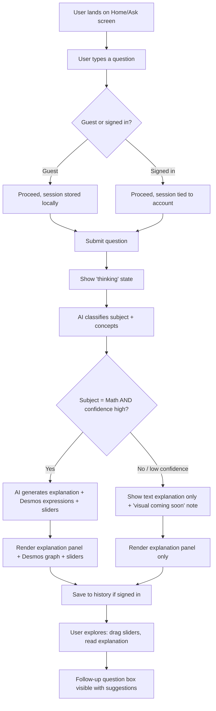
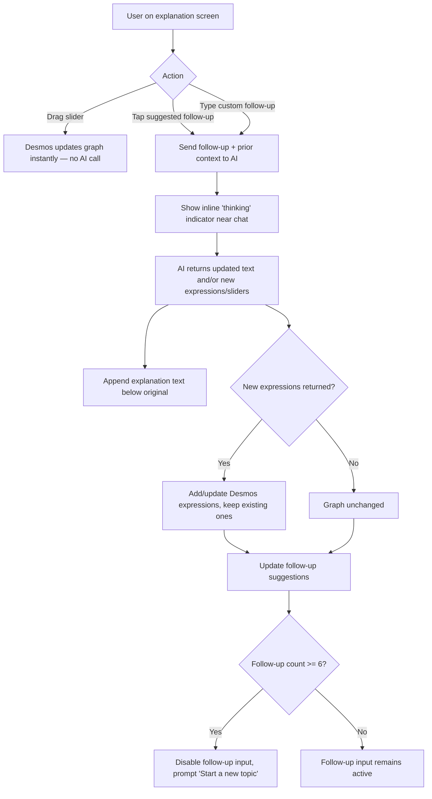
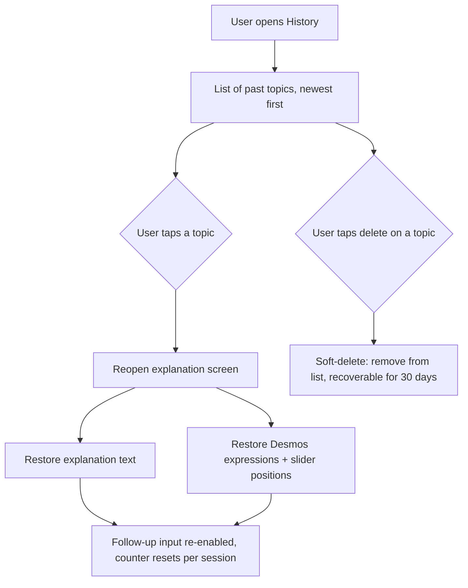
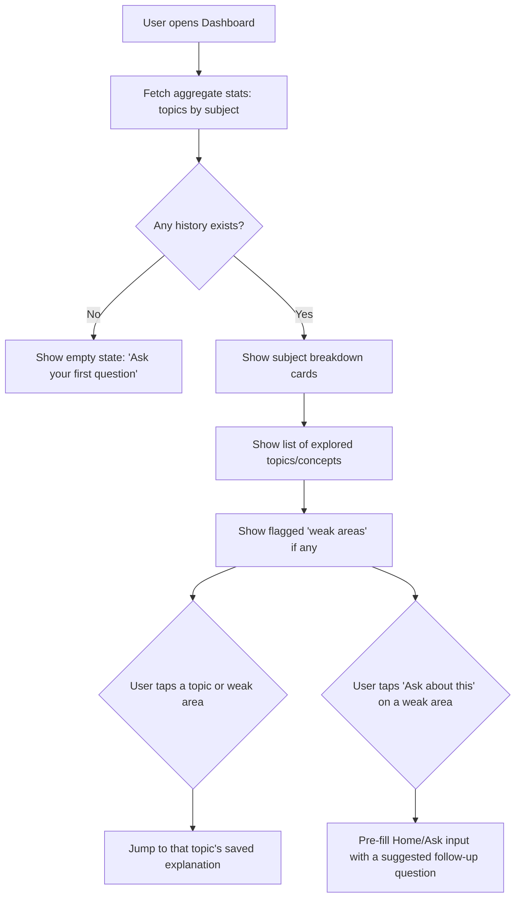
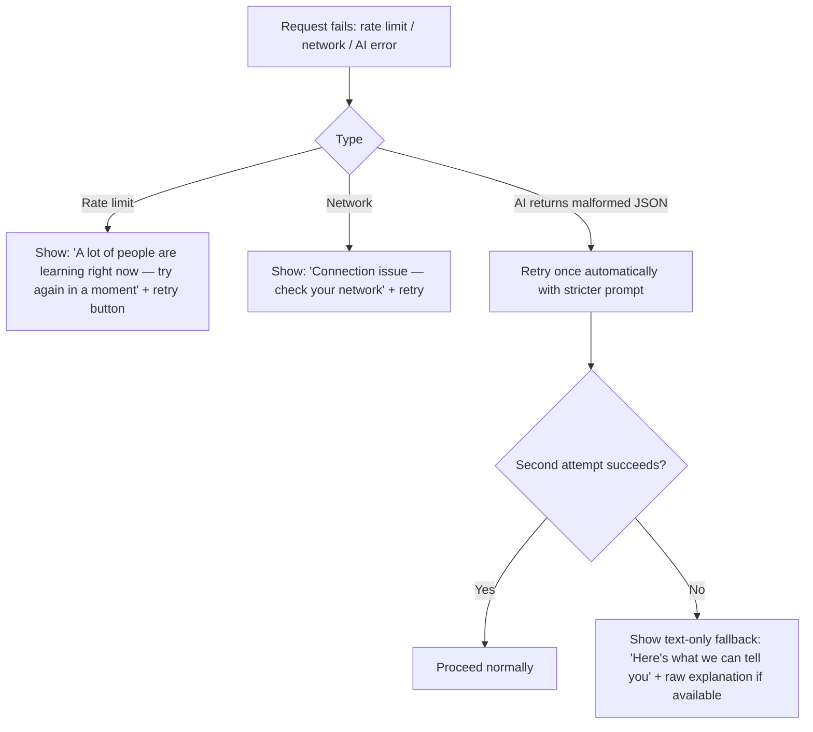

# User Flow Document

This document covers the primary flows for the MVP pilot: asking a question, viewing the interactive explanation, follow-up interaction, history, and the dashboard. Diagrams are written in Mermaid syntax for easy rendering.

---

## 1. Primary Flow — Ask → Explanation → Visual

---

## 2. Follow-up Interaction Flow

---

## 3. History Flow

---

## 4. Dashboard Flow

---

## 5. Error & Edge Case Flows

---

## 6. End-to-End Session Example (Narrative)

1. A guest user lands on the Home screen and types: *"Why does increasing 'a' in y = ax² make the parabola narrower?"*
2. The app shows a brief "thinking" animation (1–3 seconds).
3. Classification returns `subject: math, confidence: 0.95, concepts: ["quadratic functions", "vertical stretch"]`.
4. The explanation panel renders a 2–3 sentence summary and the key idea ("Multiplying by a larger `a` stretches the parabola vertically, making it look narrower").
5. A Desmos graph appears showing `y = a*x^2` with a slider for `a` from -5 to 5.
6. The user drags the slider — the graph updates instantly, no AI call.
7. The user taps a suggested follow-up: *"What happens if a is negative?"*
8. The AI responds with updated text ("A negative `a` flips the parabola to open downward") — Desmos already shows this when the slider goes negative, so no new expression is needed.
9. The session is saved to history automatically (prompted to sign up if guest, to keep it).
10. Later, the user opens the Dashboard and sees "Quadratic functions" listed under Math, with this topic available to revisit.