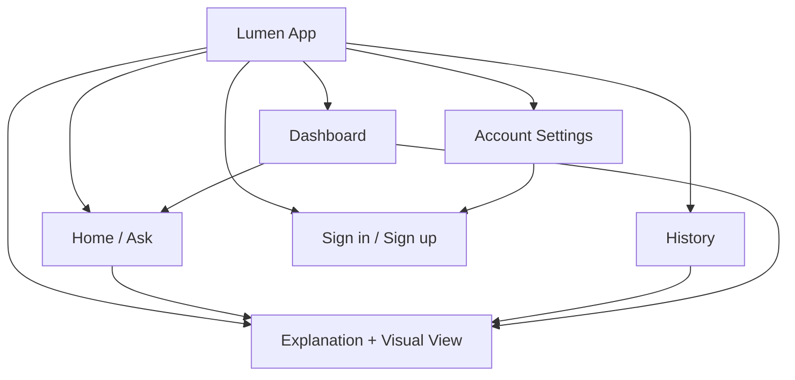

# Information Architecture

## 1. Site Map

## 2. Navigation Model

For the pilot, navigation is a **persistent left rail on desktop / bottom tab bar on mobile** with four destinations:

| Destination | Icon (lucide) | Purpose |
|---|---|---|
| Ask (Home) | `sparkles` or `message-square-plus` | Default landing screen; new question input |
| History | `clock` | Past topics, reopen explanations |
| Dashboard | `layout-grid` or `bar-chart-2` | Topic-wise summary, weak areas |
| Account | `user` | Sign in/out, profile, (future) preferences |

The **Explanation + Visual view** is not a separate nav destination — it's the result state reached from Ask, History, or Dashboard, and always includes a "← New question" affordance back to Home.

## 3. Content Hierarchy

### Home / Ask
1. App identity (logo/name) — minimal, top-left
2. Primary input (question box) — visually dominant, centered
3. Subject hint chips (optional, e.g., "Try: graphs, equations, functions") — secondary
4. Recent topics (last 3) — tertiary, below the fold or in a side panel on desktop

### Explanation + Visual View
1. Question asked (small, as breadcrumb/header)
2. Subject tag (color-coded — see Design System)
3. **Visual canvas** (Desmos graph + sliders) — primary focus, largest element
4. Explanation text (summary + key idea) — adjacent to canvas
5. Follow-up suggestions (chips) + follow-up input — below explanation
6. Conversation thread (follow-ups asked so far) — appended below

### History
1. Filter/sort controls (by subject, by date) — top
2. List of topic cards: title, subject tag, date, preview snippet
3. Empty state if no history

### Dashboard
1. Subject breakdown (cards: Math / Chemistry / Biology / Physics with counts — others greyed "coming soon" in MVP)
2. Topics explored (tag cloud or list, grouped by subject)
3. Weak areas (highlighted list with "Ask about this" action)
4. (V2) Quiz performance summary

## 4. URL / Route Structure

| Route | Screen |
|---|---|
| `/` | Home / Ask |
| `/explain/:sessionId` | Explanation + Visual view (also used for history items) |
| `/history` | History list |
| `/dashboard` | Dashboard |
| `/auth/sign-in`, `/auth/sign-up` | Auth screens |
| `/account` | Account settings |

## 5. Data Grouping (conceptual, maps to DB schema)

- **User** → has many **Sessions** (a "session" = one topic/question thread, including its follow-ups)
- **Session** → belongs to one **Subject**, has many **Concepts** (tags), has one **Explanation snapshot**, has one **Visual config** (e.g., Desmos expressions/sliders state)
- **Dashboard** is a derived/aggregated view over a user's Sessions — not its own stored entity in MVP

## 6. Cross-Cutting States

Every screen must account for:
- **Guest vs signed-in** (History/Dashboard show a "Sign up to save your progress" prompt for guests rather than being hidden entirely)
- **Empty state** (no history, no dashboard data yet)
- **Loading state** (AI "thinking", graph initializing)
- **Error state** (rate limit, network, malformed AI response)