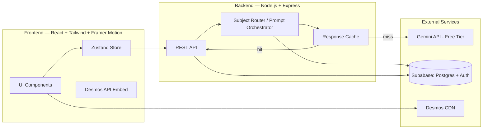

# Technical Design Document

## 1. Architecture Overview



## 2. Frontend

- **Framework:** React (Vite for fast dev/build), Tailwind CSS for styling, Framer Motion for transitions.
- **State management:** Zustand — a single `sessionStore` (current question, explanation, expressions, sliders, follow-up thread) and a `userStore` (auth state, history cache, dashboard aggregates).
- **Visualization:** Desmos Calculator API loaded via script tag, instantiated once, controlled imperatively (`setExpression`, `setExpressions`) from React via a thin wrapper component (`<DesmosCanvas expressions sliders onSliderChange />`).
- **Routing:** React Router, matching the route table in the Information Architecture doc.
- **Hosting:** Vercel (free tier) — static frontend build, environment-driven API base URL.

## 3. Backend

- **Framework:** Node.js + Express, deployed on Render or Fly.io (free tier).
- **Responsibilities:**
  1. Receive question + (optional) prior session context from frontend.
  2. Run classification + explanation generation against Gemini.
  3. Validate/repair AI JSON output (schema check, one retry with a stricter prompt if invalid).
  4. Cache responses (see §5).
  5. Persist sessions/history to Supabase.
  6. Serve history/dashboard aggregate queries.

- **Why a backend at all (vs calling Gemini from the client):** keeps the API key server-side, enables caching/rate-limit handling shared across users, and allows response post-processing (JSON validation/repair) before the client ever sees it.

## 4. AI Integration (Gemini)

- **Model:** Gemini 2.0/2.5 Flash (free tier) — fast and cheap enough for classification + explanation in one or two calls.
- **Call structure (MVP):**
  - **Call 1 — Classify + Explain (combined for cost control):** single prompt returns the full JSON schema from the Feature Spec (`subject`, `confidence`, `concepts`, `summary`, `key_idea`, `expressions`, `sliders`, `follow_up_suggestions`) in one round trip.
  - **Call 2+ — Follow-up:** includes a compact context block (subject, concepts, current expressions, prior summary — not full conversation history, to limit token usage) plus the new question.
- **Prompting approach:** system prompt enforces "respond with JSON only, matching this schema exactly," with a fallback instruction to omit `expressions`/`sliders` entirely if the subject isn't math (rather than guessing).
- **JSON validation:** backend uses a schema validator (e.g., Zod) against the expected shape; on failure, one retry with "Your last response was not valid JSON matching the schema. Return only JSON." appended.

## 5. Caching & Rate-Limit Strategy (critical for free-tier Gemini)

- **Normalization + cache key:** lowercase, trim, and lightly normalize the question text (strip punctuation/extra whitespace) to form a cache key; identical/near-identical questions across users return cached results.
- **Cache store:** Supabase table (`ai_response_cache`) keyed by normalized question hash, storing the full AI JSON response and a timestamp. Simple TTL (e.g., 30 days) — math explanations don't go stale.
- **Rate-limit handling:** if Gemini returns a 429, the backend queues the request (simple in-memory queue with a short delay/backoff) rather than failing immediately; if the queue exceeds a threshold, return the "lots of people learning right now" error state from the User Flow doc.
- **Cost control on follow-ups:** cap at 6 follow-ups per session (per Feature Spec) and keep follow-up context minimal (summary + expressions, not full chat history).

## 6. Subject Routing Logic

For MVP, only `math` produces a visual. The router is intentionally simple:

```
if (confidence < 0.6) -> ask user to confirm subject (default: text-only)
else if (subject == "math") -> render DesmosCanvas with expressions/sliders
else -> render text-only explanation + "visual support coming soon for {subject}"
```

This keeps the architecture ready for V2 (chemistry/biology/physics) without building those renderers now — the router simply gains new branches, each pointing at its respective visual component.

## 7. Database

Supabase (managed Postgres + Auth). See **Database Schema Document** for full table definitions. Summary of core tables: `users` (managed by Supabase Auth), `sessions`, `concepts`, `follow_ups`, `ai_response_cache`.

## 8. Environments & Deployment

| Environment | Frontend | Backend | DB |
|---|---|---|---|
| Local dev | Vite dev server | `node` with `.env` (Gemini key, Supabase keys) | Supabase project (shared dev) |
| Pilot/Production | Vercel | Render/Fly.io | Supabase (same project, separate tables or row-level scoping if needed) |

- Secrets (Gemini API key, Supabase service role key) stored as environment variables on the host — never exposed to the client.
- CORS restricted to the deployed frontend origin.

## 9. Monitoring (Lightweight, for a pilot)

- Log every AI call's latency, success/failure, and whether it was served from cache (simple structured logs, viewable in Render/Fly dashboard).
- A basic `/health` endpoint for uptime checks.
- Daily count of Gemini calls vs free-tier daily limit, logged so the founder can see when caching is/isn't sufficient.

## 10. Open Technical Risks

- **Desmos licensing for non-educational/commercial use** — confirm terms before any monetization; architecture keeps `DesmosCanvas` as a swappable component so Plotly/D3 can replace it if needed.
- **Gemini free-tier daily cap** — if the pilot exceeds it, the only short-term lever is caching + queueing; a paid tier or a secondary provider (e.g., a different free-tier model) would need to be evaluated.
- **JSON reliability from the LLM** — schema validation + one retry is the MVP mitigation; if failure rates are high in practice, consider Gemini's structured output / function-calling mode if available on the free tier.