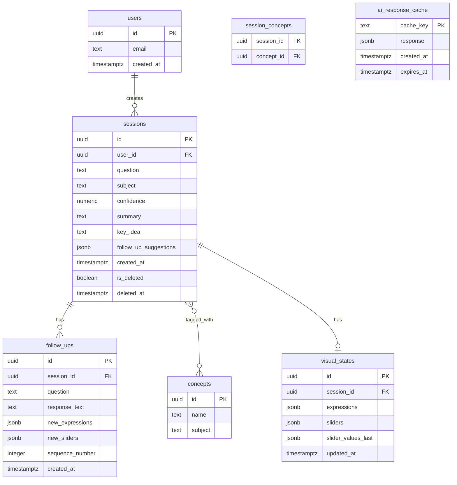

# Database Schema Document

Target: Supabase (Postgres). Auth is handled by Supabase Auth (`auth.users`), referenced here as `users` for clarity.

## 1. Entity-Relationship Diagram

## 2. Table Definitions

### `users` (managed by Supabase Auth)
Standard Supabase Auth table. Referenced via `user_id` foreign keys. No custom columns needed for MVP beyond what Supabase Auth provides (id, email, created_at).

### `sessions`
One row per "topic thread" — the initial question plus everything generated from it.

| Column | Type | Notes |
|---|---|---|
| `id` | uuid, PK | |
| `user_id` | uuid, FK → users.id, nullable | nullable to support guest sessions (merged on sign-up) |
| `question` | text | original user question |
| `subject` | text | `math`, `chemistry`, `biology`, `physics`, or `unclassified` |
| `confidence` | numeric | classification confidence score |
| `summary` | text | AI-generated explanation summary |
| `key_idea` | text | one-sentence "aha" |
| `follow_up_suggestions` | jsonb | array of suggested follow-up strings |
| `created_at` | timestamptz | default `now()` |
| `is_deleted` | boolean | default `false` — soft delete |
| `deleted_at` | timestamptz | nullable |

**Indexes:** `(user_id, created_at desc)` for history listing; `(subject)` for dashboard aggregation.

### `visual_states`
1:1 with `sessions`, for math (MVP). Stores the Desmos configuration so a session can be reopened in its last state.

| Column | Type | Notes |
|---|---|---|
| `id` | uuid, PK | |
| `session_id` | uuid, FK → sessions.id, unique | |
| `expressions` | jsonb | array of Desmos expression strings/objects |
| `sliders` | jsonb | array of `{variable, min, max, default, step, label}` |
| `slider_values_last` | jsonb | last known slider values, for restoring state |
| `updated_at` | timestamptz | |

### `follow_ups`
One row per follow-up question within a session.

| Column | Type | Notes |
|---|---|---|
| `id` | uuid, PK | |
| `session_id` | uuid, FK → sessions.id | |
| `question` | text | |
| `response_text` | text | |
| `new_expressions` | jsonb | nullable — added/updated Desmos expressions, if any |
| `new_sliders` | jsonb | nullable |
| `sequence_number` | integer | 1–6, enforces the follow-up cap at the application layer |
| `created_at` | timestamptz | |

### `concepts` / `session_concepts`
Normalized tags for dashboard aggregation (e.g., "quadratic functions", "vertical stretch"). Many-to-many via `session_concepts`.

| `concepts` column | Type |
|---|---|
| `id` | uuid, PK |
| `name` | text, unique per subject |
| `subject` | text |

| `session_concepts` column | Type |
|---|---|
| `session_id` | uuid, FK |
| `concept_id` | uuid, FK |

### `ai_response_cache`
Caches full AI JSON responses keyed by a normalized-question hash, to reduce Gemini calls (see Technical Design Document §5).

| Column | Type | Notes |
|---|---|---|
| `cache_key` | text, PK | hash of normalized question (+ subject if pre-known) |
| `response` | jsonb | full AI response payload |
| `created_at` | timestamptz | |
| `expires_at` | timestamptz | e.g., `created_at + 30 days` |

## 3. Dashboard Aggregation (no dedicated table for MVP)

The dashboard is computed via queries rather than stored:

- **Topics by subject:** `SELECT subject, count(*) FROM sessions WHERE user_id = :id AND is_deleted = false GROUP BY subject`
- **Concepts explored:** join `sessions` → `session_concepts` → `concepts` for the user
- **Weak areas:** sessions where `(SELECT count(*) FROM follow_ups WHERE session_id = s.id) >= 2` AND follow-up text matches a simple confusion-keyword heuristic (e.g., contains "don't understand", "why", "confused") — computed at query time or cached per-session as a boolean flag updated when a follow-up is inserted.

## 4. Row-Level Security (Supabase)

- `sessions`, `visual_states`, `follow_ups`: RLS policy restricting `select/insert/update` to rows where `user_id = auth.uid()`, with an exception allowing `user_id IS NULL` (guest) writes from the backend service role only.
- `ai_response_cache`: no user-level RLS — shared across all users (read via backend service role only, not directly from client).
- `concepts` / `session_concepts`: `concepts` is globally readable; `session_concepts` follows the same `user_id` ownership via its parent `session`.

## 5. Migration Notes for V2

- Add `quizzes` and `quiz_attempts` tables (question text, options, correct answer, user's answer, score) — links to `sessions`/`concepts`.
- Add `practice_plans` table for the daily-practice-plan feature.
- `visual_states.expressions`/`sliders` schema is intentionally generic (jsonb) so chemistry (`smiles`, `pdb`) and biology/physics (diagram/sim configs) can reuse the same table with subject-specific keys rather than new tables.